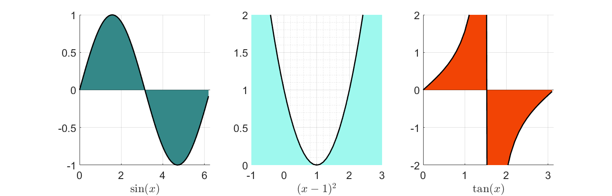

# Some Useful MATLAB Scripts

---
## [Confidence Interval Plot](https://github.com/simewu/matlab-scripts/blob/main/Confidence%20Inverval%20Plot/ConfidenceIntervalPlotDemo.m)


In Excel, calculate the 95% confidence interval of a `RANGE` of cells with
```
=CONCAT(AVERAGE(RANGE), " ± ", CONFIDENCE(1-0.95, STDEV.P(RANGE), COUNT(RANGE)))
```
For bar plot color schemes, please use https://color.adobe.com/explore

---
## [Cumulative Distribution Function Plot](CDF%20Plot/CDFPlotDemo.m)

The dotted line is the average while the solid line shows the distribution of the data (CDF).

---
## [Hatched Bar Plot](https://github.com/simewu/matlab-scripts/blob/main/Hatched%20Bar%20Plot/Hatchfill2BarPlotDemo.m)

Requires three file dependencies:

* `hatchfill2.m` https://github.com/simewu/matlab-scripts/blob/main/Hatched%20Bar%20Plot/hatchfill2.m
  * Note: this is a modified file that enables any color to be used. The more limited original hatchfill2 can be found [here](https://github.com/hokiedsp/matlab-hatchfill2/blob/master/hatchfill2.m).
* `legendflex.m` https://github.com/kakearney/legendflex-pkg/blob/master/legendflex/legendflex.m
* `getpos.m` https://github.com/kakearney/legendflex-pkg/blob/master/setgetpos_V1.2/getpos.m

_Note: Saving a hatched plot as a PDF requires CTRL+S instead of clicking the save icon, since the legendflex is a figure in and of itself. The PDF needs to be cropped using a software like Adobe Acrobat._

---
## [Sub-plots](Subplots/SubPlotDemo.m)


---
## [RGB2HEX](rgb2hex.m) and [HEX2RGB](hex2rgb.m)